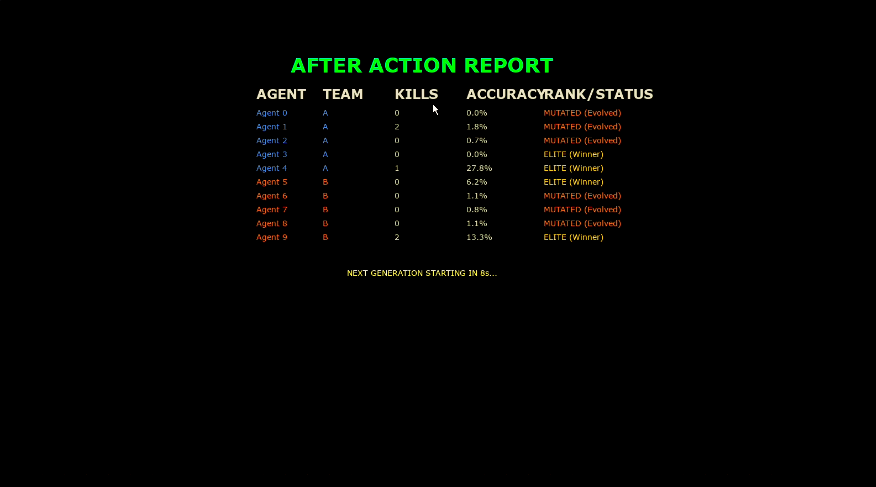
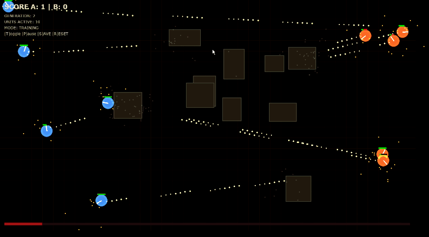
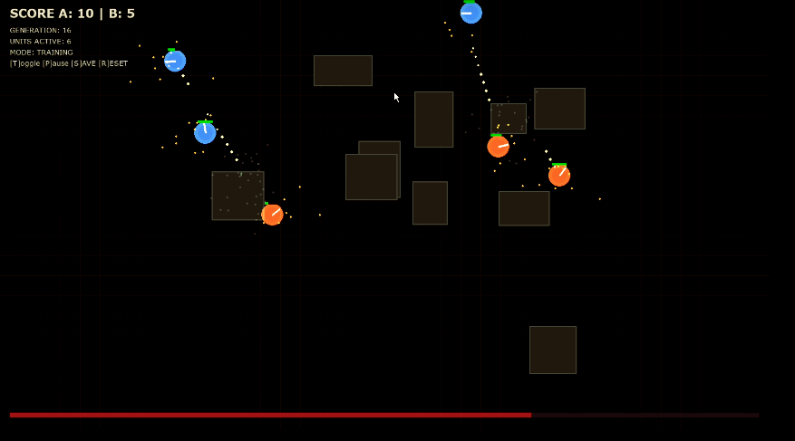

# 🦾 Echo-5 AI: 5v5  Tactical Evolution Arena



A high-fidelity, 10-agent (5v5) combat simulation where decentralized intelligence is forged through **Reinforcement Learning** and refined via **Genetic Algorithms**. 

This project demonstrates emergent tactical behaviors, such as flanking, using cover, and precision targeting, all within a procedurally generated environment.

---

## ⚡ Key Features

*   **Hybrid AI Brains**: Combines **Proximal Policy Optimization (PPO)** for low-level tactical control with a **Genetic Algorithm (GA)** for population-level evolution.
*   **Tactical Ray-Casting**: Agents "see" their environment using an 8-way ray-casting system, allowing them to detect walls, obstacles, and enemy Line-of-Sight (LOS).
*   **Aggressive Neuroevolution**: Underperforming agents are phased out every generation, replaced by mutated clones of the "Elites" to ensure rapid skill refinement.
*   **Procedural Battlefields**: Every round features a unique layout of obstacles, forcing the AI to generalize strategies rather than memorizing paths.
*   **After Action Report (AAR)**: A professional post-match analysis screen tracking Kills, Accuracy, and Mutation Status.

---

## 🛠️ Technical Architecture

### 1. Neural Network (Actor-Critic)
Each agent is powered by a `torch` neural network that processes 19 input dimensions (vision, relative enemy position, health, etc.) into 3 discrete actions:
- **Move**: Forward, Backward, or Idle.
- **Rotate**: Left, Right, or Idle.
- **Combat**: Fire or Hold.

### 2. Evolutionary Loop
At the end of each generation:
1. **Selection**: The top 2 agents from each team are designated as "Elites."
2. **Fitness Eval**: Fitness is calculated based on `Kills + (Damage * 0.5) + Accuracy`.
3. **Mutation**: Non-elites are replaced by clones of the Elites with a **1.5% mutation rate** applied to their neural weights.

### 3. Visual Rendering
Built using **Pygame** with custom effects:
- High-fidelity particle engine for muzzle flashes and impacts.
- Dynamic screen-shake and radial vignettes.
- Real-time HUD and stalemating timer.

---

## 📸 Screenshots & UI


*Real-time combat HUD showing tactical vision and stalemating progress.*


*Detailed After Action Report (AAR) showing the evolutionary selection process.*

---

## 🚀 Getting Started

### Prerequisites
- Python 3.8+
- PyTorch
- Pygame
- NumPy

### Installation
1. Clone the repository:
   ```bash
   git clone https://github.com/your-username/5V5-Tactical-Arena.git
   ```
2. Install dependencies:
   ```bash
   pip install torch pygame numpy
   ```

### Running the Simulation
Execute the main script:
```bash
python arena_sim.py
```
- **F**: Toggle Fullscreen.
- **R**: Manual Reset (Triggers evolution).
- **Auto-Continue**: The AAR screen auto-launches the next generation after 9 seconds.

---

## 📂 Project Structure
- `arena_sim.py`: The core engine, physics, and AI training loop.
- `img/`: Visual assets and screenshots.
- `models/`: Automatically saved `.pth` files for the neural weights.

---

## 📜 License
This project is licensed under the MIT License - see the LICENSE file for details.
